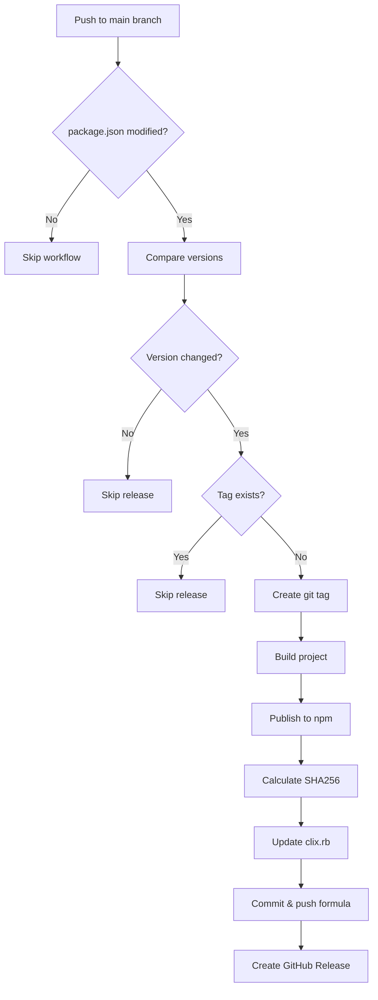

# GitHub Actions Workflow Overview

## Release Workflow

The release workflow is designed to be **fully automatic** when you push version changes to the main branch.

### Trigger

The workflow triggers when:
- You push to the `main` branch
- The `package.json` file is modified
- OR you manually trigger it via GitHub Actions UI

### Workflow Steps



### Version Change Detection

The workflow intelligently detects version changes:

1. **Fetches last 2 commits** to compare
2. **Reads current version** from package.json
3. **Reads previous version** from package.json in the previous commit
4. **Compares versions** - if different, proceeds with release
5. **Checks for existing tag** - if tag already exists, skips release

### Smart Skipping

The workflow **skips unnecessary releases** in these cases:

- ❌ Version in package.json hasn't changed
- ❌ Git tag for the version already exists
- ❌ Only other files changed (not package.json)

This prevents:
- Duplicate releases
- Wasted CI time
- Accidental re-publishes

### Release Process

When a version change is detected:

1. **Creates git tag** (e.g., `v1.0.1`)
2. **Installs dependencies** (`npm ci`)
3. **Builds the project** (`npm run build`)
4. **Publishes to npm** with provenance
5. **Downloads tarball** from npm registry
6. **Calculates SHA256** hash of the tarball
7. **Updates Homebrew formula** with new version and hash
8. **Commits and pushes** the updated formula to main
9. **Creates GitHub Release** with release notes and artifacts

### Required Secrets

- `NPM_TOKEN`: For publishing to npm registry
- `GITHUB_TOKEN`: Automatically provided by GitHub Actions

See [SETUP.md](SETUP.md) for configuration instructions.

## Usage Examples

### Example 1: Patch Release

```bash
# Fix a bug in your code
git commit -am "fix: resolve installation issue"

# Bump patch version (1.0.0 -> 1.0.1)
npm version patch

# Push to main - this triggers the release!
git push origin main
```

Result: Automatic release of v1.0.1

### Example 2: Minor Release

```bash
# Add a new feature
git commit -am "feat: add new config option"

# Bump minor version (1.0.1 -> 1.1.0)
npm version minor

# Push to main
git push origin main
```

Result: Automatic release of v1.1.0

### Example 3: Major Release

```bash
# Make breaking changes
git commit -am "feat!: change CLI API"

# Bump major version (1.1.0 -> 2.0.0)
npm version major

# Push to main
git push origin main
```

Result: Automatic release of v2.0.0

### Example 4: No Release

```bash
# Update documentation
git commit -am "docs: update README"

# Push to main without version change
git push origin main
```

Result: Workflow runs but skips release (no version change detected)

## Monitoring Releases

### Check Workflow Status

1. Go to: https://github.com/clix-so/homebrew-clix-cli/actions
2. Find the latest "Release" workflow run
3. Click to see detailed logs

### Verify Release

```bash
# Check npm
npm view @clix-so/clix-cli version

# Check GitHub releases
# https://github.com/clix-so/homebrew-clix-cli/releases

# Check git tags
git fetch --tags
git tag -l

# Test Homebrew installation
brew update
brew reinstall clix-so/clix-cli/clix
clix --version
```

## Troubleshooting

### Workflow runs but skips release

**Cause**: Version in package.json hasn't changed

**Solution**:
```bash
npm version patch  # or minor, or major
git push origin main
```

### "Tag already exists" error

**Cause**: Git tag for this version already exists

**Solution**: Either:
1. Bump to a new version: `npm version patch`
2. Delete the existing tag (not recommended):
   ```bash
   git tag -d v1.0.0
   git push origin :refs/tags/v1.0.0
   ```

### npm publish fails

**Cause**: Version already published to npm or NPM_TOKEN invalid

**Solution**:
1. Bump to a new version if already published
2. Regenerate NPM_TOKEN if expired (see [SETUP.md](SETUP.md))

### Formula update fails to push

**Cause**: Insufficient permissions

**Solution**:
1. Go to Settings → Actions → General
2. Set "Workflow permissions" to "Read and write permissions"
3. Save and re-run the workflow

## Best Practices

1. **Always use `npm version`** to bump versions (it updates package.json and package-lock.json correctly)
2. **Commit other changes first** before bumping version
3. **Use conventional commit messages** for better release notes
4. **Test locally** before pushing (`npm run build`, `npm link`)
5. **Monitor the workflow** after pushing to catch issues early
6. **Wait for completion** before announcing releases

## CI Workflow

The repository also has a separate CI workflow that:
- Runs on PRs and pushes to main/develop
- Tests the build on multiple Node.js versions (18, 20, 22)
- Runs type checking
- Does NOT trigger releases

See [ci.yml](../workflows/ci.yml) for details.
